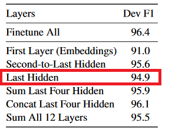
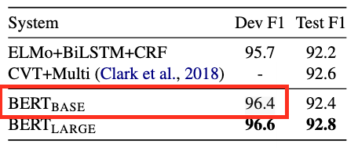

# PyTorch Implementation of NER with pretrained Bert

I know that you know [BERT](https://arxiv.org/abs/1810.04805).
In the great paper, the authors claim that the pretrained models do great in NER.
It's even impressive, allowing for the fact that they don't use any prediction-conditioned algorithms like CRFs.
We try to reproduce the result in a simple manner.

## Requirements
* python>=3.6 (Let's move on to python 3 if you still use python 2)
* pytorch==1.0
* pytorch_pretrained_bert==0.6.1
* numpy>=1.15.4

## Training & Evaluating

* STEP 1. Run the command below to download conll 2003 NER dataset.
```
bash download.sh
```
It should be extracted to `conll2003/` folder automatically.

* STEP 2a. Run the command if you want to do the feature-based approach.
```
python train.py --logdir checkpoints/feature --batch_size 128 --top_rnns --lr 1e-4 --n_epochs 30
```

* STEP 2b. Run the command if you want to do the fine-tuning approach.
```
python train.py --logdir checkpoints/finetuning --finetuning --batch_size 32 --lr 5e-5 --n_epochs 3
```

## Results in the paper

* Feature-based approach



* Fine-tuning



## Results

* F1 scores on conll2003 valid dataset are reported.
* You can check the classification outputs in [checkpoints](checkpoints).

|epoch|feature-based|fine-tuning|
|--|--|--|
|1|0.2|0.95|
|2|0.75|0.95|
|3|0.84|0.96|
|4|0.88|
|5|0.89|
|6|0.90|
|7|0.90|
|8|0.91|
|9|0.91|
|10|0.92|
|11|0.92|
|12|0.93|
|13|0.93|
|14|0.93|
|15|0.93|
|16|0.92|
|17|0.93|
|18|0.93|
|19|0.93|
|20|0.93|
|21|**0.94**|
|22|**0.94**|
|23|0.93|
|24|0.93|
|25|0.93|
|26|0.93|
|27|0.93|
|28|0.93|
|29|**0.94**|
|30|0.93|
